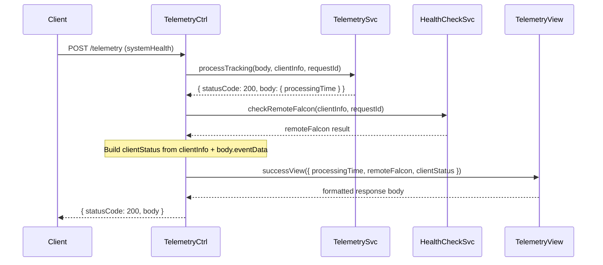

# Design Document: Add Client Status to System Health

## Overview

This feature adds a `clientStatus` property to the telemetry endpoint's success response for `systemHealth` events. The `clientStatus` object echoes back the requesting client's IP address, user agent string, and the validated `eventData` from the request body. This enables client applications to verify what the server received and confirm their identity.

The change follows the existing pattern established by `remoteFalcon` — the controller conditionally assembles the data, and the view conditionally includes it in the response. No new services or modules are needed; this is a pass-through of already-validated request data.

### Design Rationale

- The controller already has access to `clientInfo` (from the router) and `body.eventData` (from the request). No additional service calls are required.
- The view already conditionally includes `remoteFalcon`. Adding `clientStatus` follows the identical pattern, keeping the separation of concerns intact.
- The `eventData` is passed through as-is after validation by `TelemetrySvc.processTracking()`. No transformation, filtering, or defaulting is applied — if optional fields like `rateLimitStatus` are absent, they are simply omitted.

## Architecture

The existing Controller → Service → View architecture remains unchanged. The data flow for `systemHealth` events gains one additional step in the controller:



For non-systemHealth events, the flow is unchanged — no `remoteFalcon` or `clientStatus` is added.

### Affected Modules

| Module | Change |
|--------|--------|
| `telemetry.controller.js` | Add `clientStatus` to `viewData` for systemHealth events |
| `telemetry.view.js` | Conditionally include `clientStatus` in success response |
| `telemetry.controller.test.js` | Add tests for clientStatus assembly |
| `telemetry.view.test.js` | Add tests for clientStatus formatting |
| `telemetry.property.test.js` | Add property tests for round-trip fidelity |

### Modules NOT Changed

| Module | Reason |
|--------|--------|
| `telemetry.service.js` | No new validation or processing logic needed |
| `health-check.service.js` | Unrelated to client status |
| `config/*` | No configuration changes |

## Components and Interfaces

### Controller Changes (`telemetry.controller.js`)

The `post()` function's systemHealth branch gains one additional assignment after the existing `remoteFalcon` line:

```javascript
if (body.eventType === 'systemHealth') {
    viewData.remoteFalcon = await HealthCheckSvc.checkRemoteFalcon(clientInfo, requestId);
    viewData.clientStatus = {
        ip: clientInfo.ipAddress,
        userAgent: clientInfo.userAgent,
        eventData: body.eventData
    };
}
```

The `clientStatus` object is only added when:
1. `body.eventType === 'systemHealth'` (same guard as `remoteFalcon`)
2. `TelemetrySvc.processTracking()` returned `statusCode === 200` (validation passed)

No `clientStatus` is added for:
- Non-systemHealth event types
- Validation errors (400 responses)
- Parse errors (null body)

### View Changes (`telemetry.view.js`)

The `successView()` function gains a conditional block after the existing `remoteFalcon` block:

```javascript
if (data.clientStatus) {
    response.clientStatus = data.clientStatus;
}
```

This mirrors the existing `remoteFalcon` pattern exactly. The view passes through the `clientStatus` object as-is — no transformation, no defaults, no filtering.

### Updated JSDoc

The `successView` function's JSDoc will be updated to document the new optional `data.clientStatus` parameter and the corresponding response property.

The `post` function's JSDoc will be updated to document that systemHealth responses now include both `remoteFalcon` and `clientStatus`.

## Data Models

### Client Status Object

The `clientStatus` object has exactly three top-level keys:

```typescript
interface ClientStatus {
    ip: string;           // From clientInfo.ipAddress, returned as-is
    userAgent: string;    // From clientInfo.userAgent, returned as-is
    eventData: object;    // From body.eventData, passed through as-is
}
```

### eventData Structure (pass-through)

The `eventData` is the validated object from the request body. For systemHealth events, it has been validated by `TelemetrySvc.validateSystemHealthData()` before reaching the controller's success path. The structure is:

```typescript
interface SystemHealthEventData {
    totalRequests: number;      // Required, non-negative
    failedRequests: number;     // Required, non-negative, <= totalRequests
    errorRate: number;          // Required, 0-1
    rateLimitStatus?: {         // Optional
        isRateLimited?: boolean;
        requestsInWindow?: number;  // Non-negative if present
    };
    [key: string]: any;         // Extra fields are passed through
}
```

### View Data Object (updated)

```typescript
interface ViewData {
    processingTime: number;
    remoteFalcon?: RemoteFalconStatus;  // systemHealth only
    clientStatus?: ClientStatus;         // systemHealth only (NEW)
}
```

### Example Response (systemHealth, full)

```json
{
    "message": "Tracking data received successfully",
    "timestamp": "2026-04-13T03:19:42.598Z",
    "processingTime": 1,
    "remoteFalcon": {
        "isConnected": true,
        "statusCode": 200,
        "viewerControlEnabled": false,
        "viewerControlMode": "JUKEBOX",
        "playingNow": "",
        "playingNext": ""
    },
    "clientStatus": {
        "ip": "10.0.0.1",
        "userAgent": "Mozilla/5.0",
        "eventData": {
            "totalRequests": 1500,
            "failedRequests": 12,
            "errorRate": 0.008,
            "rateLimitStatus": {
                "isRateLimited": false,
                "requestsInWindow": 42
            }
        }
    }
}
```

### Example Response (systemHealth, minimal eventData)

```json
{
    "message": "Tracking data received successfully",
    "timestamp": "2026-04-13T03:19:42.598Z",
    "processingTime": 1,
    "remoteFalcon": { "isConnected": true, "statusCode": 200 },
    "clientStatus": {
        "ip": "10.0.0.1",
        "userAgent": "Mozilla/5.0",
        "eventData": {
            "totalRequests": 0,
            "failedRequests": 0,
            "errorRate": 0
        }
    }
}
```

### Example Response (pageView — unchanged)

```json
{
    "message": "Tracking data received successfully",
    "timestamp": "2026-04-13T03:19:42.598Z",
    "processingTime": 3
}
```

