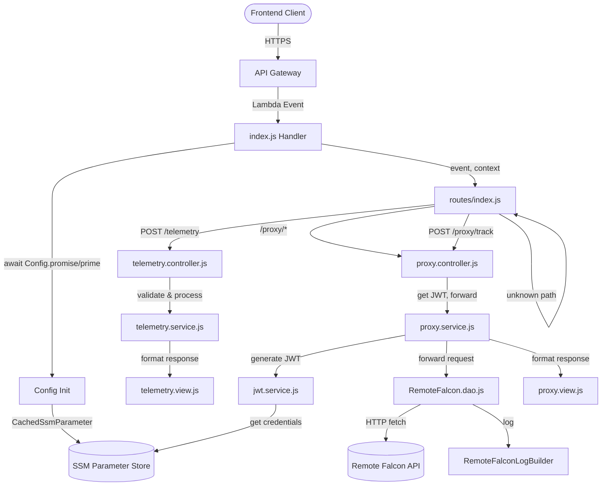

# Design Document: Convert to Atlantis

## Overview

This design describes the conversion of the Remote Falcon JWT Proxy application from a standalone AWS SAM deployment (`old-backend/`) to the Atlantis Platform framework (`application-infrastructure/`). The converted application must exhibit exact behavioral parity with the reference implementation while adopting the Atlantis MVC architecture, `@63klabs/cache-data` tooling, and Atlantis naming conventions.

The old-backend is a monolithic `index.js` (~1350 lines) containing all logic: CORS handling, credential management, JWT generation, API proxying, telemetry processing, validation, structured logging, and error handling. The conversion decomposes this into the Atlantis MVC pattern across Router, Controller, Service, Model/DAO, and View layers.

### Key Design Decisions

1. **Cache-Data tools replace custom implementations**: `ClientRequest` replaces `ClientInfo`, `Response` replaces manual response formatting, `DebugAndLog` replaces direct `console.log`/`console.error` (except for structured log entries that must match old-backend format exactly).
2. **SSM parameter paths migrate to Atlantis hierarchy**: `${PARAM_STORE_HIERARCHY}RemoteFalcon/access-token` and `secret-key` replace `/remotefalcon/${Environment}/access-token` and `secret-key`.
3. **CORS is handled via Cache-Data Response class** for standard headers, with custom origin-matching logic preserved to maintain behavioral parity.
4. **RemoteFalconLogBuilder.js is reused as-is** from `src/utils/` — it is already copied and identical to the old-backend version.
5. **jose package** is used for JWT generation (same as old-backend).
6. **Structured log entries** (`REMOTE_FALCON_REQUEST`, `REMOTE_FALCON_ERROR`, `TELEMETRY_EVENT`, `REQUEST_METRICS`, `LAMBDA_ERROR`, etc.) are emitted via `console.log` to preserve exact format parity with old-backend, since these are consumed by CloudWatch log filters and dashboards.

## Architecture



### Request Flow

1. API Gateway receives request, invokes Lambda handler
2. Handler ensures cold-start init is complete (`Config.promise()`, `Config.prime()`)
3. Router creates `ClientRequest` and `Response` objects from the event
4. Router dispatches to the appropriate Controller based on method + path
5. Controller calls Service(s) for business logic
6. Service calls Model/DAO for external data access (Remote Falcon API, SSM)
7. Controller passes service result to View for response formatting
8. Router returns the formatted `Response` object
9. Handler calls `response.finalize()` to return to API Gateway

## Components and Interfaces

### Handler (`src/index.js`)

Unchanged from the Atlantis scaffold pattern. Performs cold-start initialization via `Config.init()`, awaits `Config.promise()` and `Config.prime()`, then delegates to `Routes.process(event, context)`. Wraps in try/catch/finally with `response.finalize()`.

### Config (`src/config/index.js`)

Extends `AppConfig` from cache-data. Initializes:
- `AppConfig.init({ settings, validations, connections, responses })` 
- `Cache.init({ secureDataKey })` for the CacheData_SecureDataKey
- `Config.prime()` calls `CacheableDataAccess.prime()` and `CachedParameterSecrets.prime()`

**Settings** (`src/config/settings.js`): Add `remoteFalconApiBaseUrl` from `REMOTE_FALCON_API_BASE_URL` env var, and `allowedOrigins` from `ALLOWED_ORIGINS` env var.

**Connections** (`src/config/connections.js`): Configure the Remote Falcon API host as a cache-data endpoint connection. The DAO uses `endpoint.send()` instead of raw `fetch` to leverage cache-data's built-in X-Ray tracing. The connections array defines the Remote Falcon host (`https://remotefalcon.com`) with the base path (`/remote-falcon-external-api`), and the DAO calls `endpoint.send()` with the specific path, method, body, and authorization headers.

**Validations** (`src/config/validations.js`): Update referrers to use `ALLOWED_REFERRERS` from settings. Remove example validators (id, players). Add any path-level validation if needed, though primary validation occurs in the telemetry controller/service.

### Router (`src/routes/index.js`)

```
Interface:
  process(event, context) → Promise<Response>

Routing Table:
  OPTIONS *                    → 200 with CORS headers, empty body
  POST /telemetry              → TelemetryCtrl.post(props, REQ, RESP)
  GET  /proxy/showDetails      → ProxyCtrl.forward(props, REQ, RESP)
  POST /proxy/addSequenceToQueue → ProxyCtrl.forward(props, REQ, RESP)
  POST /proxy/voteForSequence  → ProxyCtrl.forward(props, REQ, RESP)
  ANY  /proxy/{proxy+}         → ProxyCtrl.forward(props, REQ, RESP)
  *                            → 404 NOT_FOUND with available endpoints
```

The Router uses `ClientRequest` to parse the event and `Response` to build the response. CORS headers and security headers are applied to all responses. The `Response` class from cache-data handles standard headers; custom CORS origin-matching logic is applied in the Router or a utility function to match old-backend behavior.

### Proxy Controller (`src/controllers/proxy.controller.js`)

```
Interface:
  forward(props, REQ, RESP) → Promise<Object>
    - Extracts client info from REQ (ipAddress, userAgent, host)
    - Strips /proxy prefix from path
    - Calls ProxySvc.forwardToRemoteFalcon(path, method, body, clientInfo, requestId)
    - Returns formatted response via ProxyView
```

### Proxy Service (`src/services/proxy.service.js`)

```
Interface:
  forwardToRemoteFalcon(path, method, body, clientInfo, requestId) → Promise<{statusCode, body, headers}>
    - Gets JWT via JwtSvc.getToken()
    - Delegates to RemoteFalconDao.forward(url, method, body, jwt, clientInfo, requestId)
    - Returns result
```

### JWT Service (`src/services/jwt.service.js`)

```
Interface:
  getToken() → Promise<string>
    - Checks JWT cache (55-minute TTL)
    - If expired: gets credentials via getCredentials(), generates new JWT
    - Caches and returns JWT

  getCredentials() → Promise<{accessToken, secretKey}>
    - Checks credential cache (5-minute TTL)
    - If expired: retrieves from SSM via CachedSsmParameter or direct SSM call
    - Caches and returns credentials

  generateJWT(accessToken, secretKey) → Promise<string>
    - Uses jose SignJWT to create HS256-signed JWT
    - Payload: { accessToken }
    - Expiration: 1 hour
    - Matches old-backend generateJWT exactly
```

**Credential Retrieval**: Uses `CachedSsmParameter` from cache-data for SSM access with built-in caching. The `refreshAfter` parameter is set to 43200 seconds (12 hours) for credential caching, since credentials rarely change and 5-minute refresh is excessive. JWT cache remains at 55 minutes to ensure tokens are refreshed before their 1-hour expiration.

### Remote Falcon DAO (`src/models/RemoteFalcon.dao.js`)

```
Interface:
  forward(url, method, body, jwt, clientInfo, requestId) → Promise<{statusCode, body, headers}>
    - Constructs request with Authorization: Bearer ${jwt}
    - Calls Remote Falcon API via cache-data endpoint.send() for X-Ray tracing
    - Uses RemoteFalconLogBuilder for structured logging
    - Detects application-level errors (SONG_REQUESTED, QUEUE_FULL, etc.)
    - Logs REMOTE_FALCON_REQUEST or REMOTE_FALCON_ERROR
    - Returns {statusCode, body, headers}
    - On network error: logs error, throws "Failed to communicate with Remote Falcon API"
```

This DAO replicates the `forwardToRemoteFalcon` function from old-backend, using `RemoteFalconLogBuilder` from `src/utils/` and cache-data's `endpoint.send()` for HTTP requests with X-Ray tracing.

### Telemetry Controller (`src/controllers/telemetry.controller.js`)

```
Interface:
  post(props, REQ, RESP) → Promise<Object>
    - Extracts body from REQ
    - Calls TelemetrySvc.processTracking(body, clientInfo, requestId)
    - Returns formatted response via TelemetryView
```

### Telemetry Service (`src/services/telemetry.service.js`)

```
Interface:
  processTracking(body, clientInfo, requestId) → Promise<{statusCode, body}>
    - Validates tracking data via validateTrackingData()
    - Logs TELEMETRY_EVENT structured log entry
    - Logs TELEMETRY_METRICS
    - Returns success response with message, timestamp, processingTime

  validateTrackingData(data) → {isValid, error}
    - Validates eventType (from valid set)
    - Validates url (valid URL format)
    - Validates systemHealth/systemAlert/eventFailure eventData
    - Checks for PII in eventData
    - Checks data size (10KB limit)
    - Exact behavioral parity with old-backend validateTrackingData
```

The validation functions (`validateSystemHealthData`, `validateSystemAlertData`, `validateEventFailureData`, `validateTrackingData`) are ported directly from old-backend with identical logic.

### Telemetry View (`src/views/telemetry.view.js`)

```
Interface:
  successView(data) → {message, timestamp, processingTime}
  errorView(error, errorCode) → {message, error, timestamp}
```

### Proxy View (`src/views/proxy.view.js`)

```
Interface:
  forwardView(result) → result.body (pass-through)
  notFoundView(requestId, timestamp) → {message, error, requestId, availableEndpoints, timestamp}
  authErrorView(requestId, timestamp) → {message, error, requestId, timestamp}
```

### CORS Utility (`src/utils/cors.js`)

```
Interface:
  getCorsHeaders(origin) → Object
    - Parses ALLOWED_ORIGINS env var
    - Matches origin against allowed list (exact match + wildcard patterns)
    - Returns headers object matching old-backend getCorsHeaders exactly
    - Includes security headers (X-Content-Type-Options, X-Frame-Options, etc.)
```

This is extracted from old-backend's `getCorsHeaders` function. The `Response` class from cache-data handles basic CORS via API Gateway configuration, but the custom origin-matching logic and security headers must be applied at the application level to maintain behavioral parity.

### Client Info Extraction

Cache-Data's `ClientRequest` provides `getClientIp()`, `getClientUserAgent()`, and `getClientHost()` (via `RequestInfo`). These are used directly to build the `clientInfo` object `{ipAddress, userAgent, host}` that `RemoteFalconLogBuilder` expects. No custom adapter or thin wrapper is needed — `ClientRequest` is the sole source for client information extraction.

## Data Models

### Tracking Data (Telemetry Request Body)

```javascript
{
  eventType: string,     // Required: pageView|click|videoPlay|songRequest|systemHealth|systemAlert|eventFailure
  url: string,           // Required: valid URL format
  eventData: object      // Optional for most types, required for systemHealth|systemAlert|eventFailure
}
```

### System Health Event Data

```javascript
{
  totalRequests: number,   // Required: non-negative
  failedRequests: number,  // Required: non-negative, <= totalRequests
  errorRate: number,       // Required: 0-1
  rateLimitStatus: {       // Optional
    isRateLimited: boolean,
    requestsInWindow: number
  }
}
```

### System Alert Event Data

```javascript
{
  type: string,          // Required: HIGH_ERROR_RATE|CONSECUTIVE_ERRORS
  errorRate: number,     // Required: 0-1
  threshold: number,     // Required: 0-1
  totalRequests: number, // Optional: non-negative
  failedRequests: number,// Optional: non-negative
  consecutiveErrors: number // Optional: non-negative
}
```

### Event Failure Event Data

```javascript
{
  originalEventType: string,  // Required: from valid event types (excluding eventFailure)
  failureReason: string,      // Required
  errorType: string,          // Required
  finalAttempts: number,      // Optional: non-negative
  originalEventData: object   // Optional
}
```

### JWT Token Payload

```javascript
{
  accessToken: string,  // Remote Falcon access token
  iat: number,          // Issued at (epoch seconds)
  exp: number           // Expiration (iat + 3600)
}
```

### Structured Log Entry Types

| Log Type | Fields |
|---|---|
| `REMOTE_FALCON_REQUEST` | timestamp, requestId, logType, status, request{method,path,ip,userAgent,host}, response{status,processingTime,dataSummary} |
| `REMOTE_FALCON_ERROR` | timestamp, requestId, logType, status, request{...}, error{type,message,httpStatus,processingTime} |
| `TELEMETRY_EVENT` | timestamp, eventType, ipAddress, userAgent, host, url, eventData, processingTime, requestId |
| `TELEMETRY_METRICS` | timestamp, eventType, processingTime, success, requestId |
| `REQUEST_METRICS` | requestId, timestamp, method, path, statusCode, processingTime, totalTime, success |
| `LAMBDA_ERROR` | requestId, timestamp, error{message,name,stack}, request{method,path,origin,userAgent}, totalTime |

## Correctness Properties

*A property is a characteristic or behavior that should hold true across all valid executions of a system — essentially, a formal statement about what the system should do. Properties serve as the bridge between human-readable specifications and machine-verifiable correctness guarantees.*

### Property 1: Proxy forwarding preserves path, method, body, and response

*For any* request path starting with `/proxy/`, the Converted_Application SHALL strip the `/proxy` prefix and forward the request to Remote_Falcon_API at the resulting path using the same HTTP method and body, and return the response status code and body unchanged.

**Validates: Requirements 1.1, 1.2, 1.3, 1.4, 1.5**

### Property 2: JWT token structure and signing

*For any* valid access token and secret key pair, the generated JWT SHALL be an HS256-signed token whose decoded payload contains the access token and whose expiration is approximately 1 hour from issuance.

**Validates: Requirements 2.3**

### Property 3: Valid telemetry produces correct log and response

*For any* valid tracking data object (valid eventType, valid URL, passing all validation), the telemetry endpoint SHALL return a 200 response with `message`, `timestamp`, and `processingTime` fields, and SHALL emit a `TELEMETRY_EVENT` log entry containing all required fields (timestamp, eventType, ipAddress, userAgent, host, url, eventData, processingTime, requestId).

**Validates: Requirements 3.1, 3.2**

### Property 4: Invalid tracking data is rejected with VALIDATION_ERROR

*For any* tracking data object that fails validation (missing eventType, invalid eventType, missing url, invalid URL format, failing systemHealth/systemAlert/eventFailure constraints, containing PII fields, or exceeding 10KB), the telemetry endpoint SHALL return a 400 response with a `VALIDATION_ERROR` error code and a descriptive error message.

**Validates: Requirements 3.3, 4.1, 4.2, 4.3, 4.4, 4.5, 4.6, 4.7**

### Property 5: PII detection in tracking data

*For any* eventData object containing field names that match PII patterns (email, phone, address, name, ssn, creditCard, password, token, apiKey), the validation SHALL reject the data with a descriptive error message identifying the offending field path.

**Validates: Requirements 4.6**

### Property 6: CORS and security headers on all responses

*For any* request (any method, any path, any origin), the response SHALL include `Access-Control-Allow-Origin`, `Access-Control-Allow-Headers`, `Access-Control-Allow-Methods`, `Access-Control-Allow-Credentials`, `Vary: Origin`, `X-Content-Type-Options: nosniff`, `X-Frame-Options: DENY`, `X-XSS-Protection: 1; mode=block`, `Referrer-Policy: strict-origin-when-cross-origin`, and `Content-Security-Policy`.

**Validates: Requirements 6.1, 6.4**

### Property 7: CORS origin matching

*For any* request origin and `ALLOWED_ORIGINS` configuration (including exact matches, wildcard patterns like `*.mysite.com`, and the wildcard `*`), the `Access-Control-Allow-Origin` header SHALL be set to the request origin when it matches an allowed pattern, and `Access-Control-Allow-Credentials` SHALL be `true` for non-wildcard specific origin matches.

**Validates: Requirements 6.2, 6.5**

### Property 8: OPTIONS preflight returns 200 with empty body

*For any* path, an OPTIONS request SHALL return a 200 status code with CORS headers and an empty body, without invoking any business logic (no JWT generation, no API forwarding, no telemetry processing).

**Validates: Requirements 6.3**

### Property 9: Remote Falcon log classification

*For any* Remote Falcon API response, the logging SHALL correctly classify: HTTP 2xx with no application error as `REMOTE_FALCON_REQUEST` (SUCCESS), HTTP 4xx/5xx as `REMOTE_FALCON_ERROR` with error classification, and HTTP 200 with application error patterns (SONG_REQUESTED, QUEUE_FULL, success:false, error status) as `REMOTE_FALCON_ERROR` with `APPLICATION_ERROR` type.

**Validates: Requirements 7.1, 7.2, 7.3**

### Property 10: Log entry PII sanitization

*For any* string containing email addresses, phone numbers, credit card numbers, SSN patterns, JWT tokens, API keys, access tokens, or passwords, the sanitization functions SHALL replace all matches with `[REDACTED]` markers, and log entries exceeding 10KB SHALL be truncated with a truncation indicator.

**Validates: Requirements 7.5, 7.6**

### Property 11: Unknown endpoints return 404 with available endpoints

*For any* request path that does not match a defined endpoint, the Converted_Application SHALL return a 404 status code with a JSON body containing `message: "Endpoint not found"`, `error: "NOT_FOUND"`, `requestId`, a list of `availableEndpoints`, and `timestamp`.

**Validates: Requirements 14.1**

### Property 12: Tracking data size limit enforcement

*For any* tracking data whose JSON serialization exceeds 10,000 characters, the validation SHALL reject it with the message "Tracking data too large. Maximum size is 10KB."

**Validates: Requirements 4.7**

## Error Handling

### Error Categories and Responses

| Error Scenario | Status Code | Error Code | Message |
|---|---|---|---|
| Invalid JSON body | 400 | `PARSE_ERROR` | "Invalid JSON in request body" |
| Tracking validation failure | 400 | `VALIDATION_ERROR` | (specific validation error) |
| SSM credential retrieval failure | 500 | `AUTH_ERROR` | "Authentication service unavailable" |
| Unknown endpoint | 404 | `NOT_FOUND` | "Endpoint not found" |
| Unhandled exception | 500 | `INTERNAL_ERROR` | "Internal server error" |
| Remote Falcon network failure | 500 | `INTERNAL_ERROR` | "Internal server error" (after logging REMOTE_FALCON_ERROR) |

### Error Response Structure

All error responses follow this structure (matching old-backend):

```json
{
  "message": "Human-readable error message",
  "error": "ERROR_CODE",
  "requestId": "lambda-request-id",
  "timestamp": "ISO-8601 timestamp"
}
```

### Error Propagation

- **DAO errors** (network failures, timeouts) are caught in the DAO, logged via `RemoteFalconLogBuilder`, and re-thrown as `"Failed to communicate with Remote Falcon API"`.
- **Service errors** (JWT generation, credential retrieval) are caught in the Controller and returned as 500 AUTH_ERROR.
- **Validation errors** are returned as 400 VALIDATION_ERROR from the Service layer.
- **Unhandled errors** are caught in the Handler's try/catch, logged as `LAMBDA_ERROR`, and returned as 500 INTERNAL_ERROR.

## Testing Strategy

### Dual Testing Approach

The testing strategy uses both unit tests and property-based tests to achieve comprehensive coverage and verify 1:1 behavioral parity with old-backend.

- **Unit tests**: Verify specific examples, edge cases, integration points, and error conditions
- **Property-based tests**: Verify universal properties across many generated inputs using `fast-check`

### Property-Based Testing Configuration

- Library: `fast-check` (already used in old-backend tests)
- Minimum 100 iterations per property test
- Each property test references its design document property
- Tag format: `Feature: convert-to-atlantis, Property {number}: {property_text}`

### Test Categories

#### Property-Based Tests (`src/tests/`)

Each correctness property from the design maps to a property-based test:

1. **Proxy forwarding round-trip** (Property 1): Generate random paths, methods, bodies, and mock responses. Verify the proxy strips `/proxy`, forwards correctly, and returns the response unchanged.
2. **JWT structure** (Property 2): Generate random access tokens and secret keys. Verify JWT is HS256, contains accessToken in payload, expires in ~1 hour.
3. **Valid telemetry processing** (Property 3): Generate random valid tracking data. Verify 200 response structure and TELEMETRY_EVENT log structure.
4. **Invalid tracking data rejection** (Property 4): Generate random invalid tracking data (missing fields, invalid types, constraint violations). Verify 400 VALIDATION_ERROR.
5. **PII detection** (Property 5): Generate random eventData objects with PII field names. Verify rejection.
6. **CORS/security headers** (Property 6): Generate random requests. Verify all required headers present.
7. **CORS origin matching** (Property 7): Generate random origins and ALLOWED_ORIGINS configs. Verify correct matching.
8. **OPTIONS preflight** (Property 8): Generate random paths. Verify 200, empty body, no side effects.
9. **Remote Falcon log classification** (Property 9): Generate random response scenarios. Verify correct log type classification.
10. **PII sanitization** (Property 10): Generate random strings with PII patterns. Verify redaction.
11. **Unknown endpoint 404** (Property 11): Generate random undefined paths. Verify 404 structure.
12. **Size limit enforcement** (Property 12): Generate random large tracking data. Verify rejection at 10KB.

#### Unit Tests (`src/tests/`)

- **Behavioral parity tests**: For each endpoint, compare converted application output against old-backend output for identical inputs using the old-backend mock events from `old-backend/tests/mock-events/`.
- **CORS edge cases**: Wildcard origins, missing origin header, disallowed origins.
- **JWT caching**: Verify 55-minute JWT cache, credential 12-hour cache.
- **SSM failure handling**: Verify AUTH_ERROR response.
- **RemoteFalconLogBuilder**: Verify identical log structures for success, error, and application error scenarios (these tests already exist in old-backend and can be adapted).
- **Validation functions**: Port old-backend validation tests to verify identical accept/reject behavior.

#### Integration Tests

- **Config initialization**: Verify cold-start init completes without errors.
- **SSM parameter paths**: Verify correct paths are used.
- **End-to-end request flow**: Verify complete request lifecycle through Router → Controller → Service → DAO → View.

### Test File Organization

```
src/tests/
├── proxy.controller.test.js       # Proxy endpoint unit tests
├── proxy.service.test.js          # Proxy service unit tests  
├── proxy.property.test.js         # Property tests for proxy forwarding
├── telemetry.controller.test.js   # Telemetry endpoint unit tests
├── telemetry.service.test.js      # Telemetry service + validation unit tests
├── telemetry.property.test.js     # Property tests for telemetry validation
├── jwt.service.test.js            # JWT generation and caching tests
├── jwt.property.test.js           # Property tests for JWT structure
├── cors.test.js                   # CORS handling unit tests
├── cors.property.test.js          # Property tests for CORS origin matching
├── logging.property.test.js       # Property tests for log sanitization
├── router.test.js                 # Router dispatch and 404 tests
├── parity.test.js                 # Behavioral parity tests against old-backend mock events
└── index.test.js                  # Handler integration tests (updated from scaffold)
```


## OpenAPI Specification

The `template-openapi-spec.yml` must be updated to replace the example endpoints with the Remote Falcon proxy and telemetry endpoints. All paths use `aws_proxy` integration pointing to `${AppFunction.Arn}`.

### Endpoint Definitions

```yaml
paths:
  /telemetry:
    post:
      description: "Receive and log telemetry events from frontend"
      requestBody:
        required: true
        content:
          application/json:
            schema:
              $ref: '#/components/schemas/TrackingData'
      responses:
        '200':
          description: "Tracking data received"
          content:
            application/json:
              schema:
                $ref: '#/components/schemas/TelemetrySuccess'
        '400':
          description: "Validation error"
          content:
            application/json:
              schema:
                $ref: '#/components/schemas/ErrorResponse'
        '500':
          description: "Server error"
      x-amazon-apigateway-integration:
        httpMethod: post
        type: aws_proxy
        uri:
          Fn::Sub: arn:aws:apigateway:${AWS::Region}:lambda:path/2015-03-31/functions/${AppFunction.Arn}/invocations
    options:
      description: "CORS preflight for telemetry"
      responses:
        '200':
          description: "CORS preflight response"
      x-amazon-apigateway-integration:
        httpMethod: post
        type: aws_proxy
        uri:
          Fn::Sub: arn:aws:apigateway:${AWS::Region}:lambda:path/2015-03-31/functions/${AppFunction.Arn}/invocations

  /proxy/showDetails:
    get:
      description: "Proxy GET request to Remote Falcon showDetails"
      responses:
        '200':
          description: "Show details from Remote Falcon"
      x-amazon-apigateway-integration:
        httpMethod: post
        type: aws_proxy
        uri:
          Fn::Sub: arn:aws:apigateway:${AWS::Region}:lambda:path/2015-03-31/functions/${AppFunction.Arn}/invocations

  /proxy/addSequenceToQueue:
    post:
      description: "Proxy POST request to Remote Falcon addSequenceToQueue"
      requestBody:
        required: true
        content:
          application/json:
            schema:
              type: object
      responses:
        '200':
          description: "Sequence added"
      x-amazon-apigateway-integration:
        httpMethod: post
        type: aws_proxy
        uri:
          Fn::Sub: arn:aws:apigateway:${AWS::Region}:lambda:path/2015-03-31/functions/${AppFunction.Arn}/invocations

  /proxy/voteForSequence:
    post:
      description: "Proxy POST request to Remote Falcon voteForSequence"
      requestBody:
        required: true
        content:
          application/json:
            schema:
              type: object
      responses:
        '200':
          description: "Vote recorded"
      x-amazon-apigateway-integration:
        httpMethod: post
        type: aws_proxy
        uri:
          Fn::Sub: arn:aws:apigateway:${AWS::Region}:lambda:path/2015-03-31/functions/${AppFunction.Arn}/invocations

  /proxy/{proxy+}:
    x-amazon-apigateway-any-method:
      description: "Catch-all proxy to Remote Falcon API"
      parameters:
        - name: proxy
          in: path
          required: true
          schema:
            type: string
      responses:
        '200':
          description: "Proxied response"
      x-amazon-apigateway-integration:
        httpMethod: post
        type: aws_proxy
        uri:
          Fn::Sub: arn:aws:apigateway:${AWS::Region}:lambda:path/2015-03-31/functions/${AppFunction.Arn}/invocations
    options:
      description: "CORS preflight for proxy paths"
      parameters:
        - name: proxy
          in: path
          required: true
          schema:
            type: string
      responses:
        '200':
          description: "CORS preflight response"
      x-amazon-apigateway-integration:
        httpMethod: post
        type: aws_proxy
        uri:
          Fn::Sub: arn:aws:apigateway:${AWS::Region}:lambda:path/2015-03-31/functions/${AppFunction.Arn}/invocations
```

The example `/api/example/` and `/api/example/{id}` endpoints are removed.

## CloudFormation Template Updates

### Lambda Events

Replace the example `GetApiData` and `GetById` events with:

```yaml
Events:
  TelemetryPost:
    Type: Api
    Properties:
      Path: /telemetry
      Method: post
      RestApiId: !Ref WebApi
  TelemetryOptions:
    Type: Api
    Properties:
      Path: /telemetry
      Method: options
      RestApiId: !Ref WebApi
  ProxyShowDetails:
    Type: Api
    Properties:
      Path: /proxy/showDetails
      Method: get
      RestApiId: !Ref WebApi
  ProxyAddSequence:
    Type: Api
    Properties:
      Path: /proxy/addSequenceToQueue
      Method: post
      RestApiId: !Ref WebApi
  ProxyVoteSequence:
    Type: Api
    Properties:
      Path: /proxy/voteForSequence
      Method: post
      RestApiId: !Ref WebApi
  ProxyAny:
    Type: Api
    Properties:
      Path: /proxy/{proxy+}
      Method: ANY
      RestApiId: !Ref WebApi
  ProxyOptions:
    Type: Api
    Properties:
      Path: /proxy/{proxy+}
      Method: options
      RestApiId: !Ref WebApi
```

### Environment Variables

Add to `AppFunction.Properties.Environment.Variables`:

```yaml
REMOTE_FALCON_API_BASE_URL: 'https://remotefalcon.com/remote-falcon-external-api'
ALLOWED_ORIGINS: !Ref AllowedOrigins
```

Add `AllowedOrigins` as a new template parameter:

```yaml
AllowedOrigins:
  Type: String
  Description: "Comma-delimited list of CORS allowed origins"
  Default: "*"
```

### IAM Permissions

The existing `LambdaAccessToSSMParameters` statement already grants access to `${ParameterStoreHierarchy}*`, which covers `${PARAM_STORE_HIERARCHY}RemoteFalcon/access-token` and `${PARAM_STORE_HIERARCHY}RemoteFalcon/secret-key`. No additional IAM changes are needed.

### Dependencies

Add `jose` to `src/package.json`:

```json
"dependencies": {
  "@63klabs/cache-data": "^1.3.10",
  "jose": "^6.1.3"
}
```

### API Gateway CORS Configuration

Update the `WebApi` CORS `AllowMethods` to include POST:

```yaml
Cors:
  AllowMethods: "'GET,POST,OPTIONS'"
  AllowHeaders: "'Content-Type,Authorization,X-Requested-With,Accept,Origin,Access-Control-Request-Method,Access-Control-Request-Headers'"
  AllowOrigin: "'*'"
  MaxAge: "'86400'"
```

### Build Scripts

The `buildspec.yml` already includes commands for the RemoteFalcon SSM parameters:

```yaml
- python3 ./build-scripts/update-ssm-parameters.py ${PARAM_STORE_HIERARCHY}RemoteFalcon/access-token
- python3 ./build-scripts/update-ssm-parameters.py ${PARAM_STORE_HIERARCHY}RemoteFalcon/secret-key
```

## Logging Architecture

### Structured Log Emission

Structured log entries (`REMOTE_FALCON_REQUEST`, `REMOTE_FALCON_ERROR`, `TELEMETRY_EVENT`, `REQUEST_METRICS`, `LAMBDA_ERROR`, `TELEMETRY_METRICS`) are emitted via `console.log` with the format:

```
LOG_TYPE: JSON_STRING
```

This matches old-backend exactly and is required for CloudWatch log filter compatibility. These are the only cases where `console.log` is used directly instead of `DebugAndLog`.

### DebugAndLog Usage

All other application logging uses `DebugAndLog` from cache-data:
- `DebugAndLog.debug()` for verbose development logging
- `DebugAndLog.log()` for informational messages
- `DebugAndLog.warn()` for warnings (e.g., unknown endpoint access)
- `DebugAndLog.error()` for error conditions

Log levels are controlled by the `LOG_LEVEL` environment variable (INFO for PROD, DEBUG for non-PROD), already configured in the template.

### RemoteFalconLogBuilder Integration

`RemoteFalconLogBuilder` (already in `src/utils/RemoteFalconLogBuilder.js`) is used by the Remote Falcon DAO to generate structured log entries. It provides:
- `buildSuccessLog(response, responseData)` — generates `REMOTE_FALCON_REQUEST` entries
- `buildErrorLog(error, httpStatus)` — generates `REMOTE_FALCON_ERROR` entries
- `detectApplicationError(responseData)` — detects application-level errors in HTTP 200 responses
- PII sanitization (`sanitizeErrorMessage`, `sanitizeClientInfo`, `sanitizePII`, `sanitizeObjectRecursively`)
- Log entry size limiting (`sanitizeAndLimitLogEntry` — 10KB limit)

### Log Flow

```
Request → Router → Controller → Service → DAO
                                    ↓
                              RemoteFalconLogBuilder
                                    ↓
                              console.log (structured)
                                    ↓
                              CloudWatch Logs
```

### Metrics Logging

`REQUEST_METRICS` is logged at the Router/Handler level after each request completes, capturing:
- requestId, timestamp, method, path, statusCode
- processingTime (business logic only), totalTime (including cold start)
- success indicator

`TELEMETRY_METRICS` is logged by the Telemetry Service after each telemetry request, capturing:
- timestamp, eventType, processingTime, success, requestId

## File Structure Summary

```
application-infrastructure/src/
├── index.js                          # Lambda handler (minimal changes from scaffold)
├── config/
│   ├── index.js                      # Config class (add RemoteFalcon settings)
│   ├── settings.js                   # App settings (add remoteFalconApiBaseUrl, allowedOrigins)
│   ├── connections.js                # Connections (Remote Falcon API endpoint config)
│   ├── responses.js                  # Response config (unchanged)
│   └── validations.js               # Validations (update referrers, remove examples)
├── routes/
│   └── index.js                      # Router (rewrite for RF proxy + telemetry)
├── controllers/
│   ├── index.js                      # Controller barrel export
│   ├── proxy.controller.js           # Proxy endpoint controller
│   └── telemetry.controller.js       # Telemetry endpoint controller
├── services/
│   ├── index.js                      # Service barrel export
│   ├── proxy.service.js              # Proxy forwarding service
│   ├── jwt.service.js                # JWT generation and credential caching
│   └── telemetry.service.js          # Telemetry processing and validation
├── models/
│   ├── index.js                      # Model barrel export
│   └── RemoteFalcon.dao.js           # Remote Falcon API DAO (endpoint.send + logging)
├── views/
│   ├── index.js                      # View barrel export
│   ├── proxy.view.js                 # Proxy response formatting
│   └── telemetry.view.js            # Telemetry response formatting
├── utils/
│   ├── index.js                      # Utils barrel export
│   ├── RemoteFalconLogBuilder.js     # Already present — structured logging
│   ├── cors.js                       # CORS header generation (from old-backend)
│   ├── hash.js                       # Hash utilities (unchanged)
│   └── helper-functions.js           # Helper functions (unchanged)
├── tests/
│   ├── proxy.controller.test.js
│   ├── proxy.property.test.js
│   ├── telemetry.controller.test.js
│   ├── telemetry.property.test.js
│   ├── jwt.service.test.js
│   ├── jwt.property.test.js
│   ├── cors.test.js
│   ├── cors.property.test.js
│   ├── logging.property.test.js
│   ├── router.test.js
│   ├── parity.test.js
│   └── index.test.js
└── package.json                      # Add jose dependency
```
