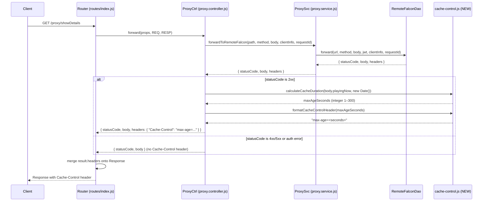

# Design Document: Dynamic Proxy Cache-Control

## Overview

This feature adds dynamic `Cache-Control` response headers to the proxy endpoint. The cache duration is determined by inspecting the `playingNow` field in the Remote Falcon API response body:

- When a sequence is actively playing (`playingNow` is a non-empty string), the response is cached for 5 seconds to allow near-real-time updates.
- When nothing is playing (`playingNow` is empty or null), the response is cached until the next 5-minute clock-aligned interval boundary (e.g., 08:00, 08:05, 08:10), up to a maximum of 300 seconds.

The core calculation is implemented as a pure function (`calculateCacheDuration`) that accepts the `playingNow` value and a `Date` object, returning an integer `max-age` value. This function lives in a new utility module and is called by the proxy controller when building the response.

Error responses (4xx/5xx from Remote Falcon, or auth errors) do not receive a `Cache-Control` header.

## Architecture

The feature introduces a single new utility module and modifies the proxy controller. No changes are needed to the Router, ProxySvc, RemoteFalconDao, or ProxyView.



### Design Decisions

1. **Pure utility function**: The cache duration calculation is a pure function with no side effects, making it trivially testable with property-based tests. The current time is injected as a parameter rather than read from `Date.now()` internally.

2. **Controller-level integration**: The `Cache-Control` header is added in `ProxyCtrl.forward()` rather than in the DAO or service layer. This keeps the DAO as a generic HTTP forwarder and places the caching policy decision at the controller level where response semantics are determined.

3. **No changes to Router**: The Router already merges `result.headers` onto the Response object, so no Router modifications are needed.

4. **Formatter/parser pair**: A `formatCacheControlHeader` and `parseCacheControlHeader` function pair enables round-trip testing of the header value.

## Components and Interfaces

### New Module: `utils/cache-control.js`

```javascript
/**
 * @module utils/cache-control
 */

/**
 * Calculate the Cache-Control max-age value based on playback state.
 *
 * @param {string|null} playingNow - The playingNow field from the Remote Falcon response
 * @param {Date} now - The current time
 * @returns {number} max-age in seconds (integer, 1–300 inclusive)
 */
function calculateCacheDuration(playingNow, now) { }

/**
 * Format a max-age integer into a Cache-Control header value.
 *
 * @param {number} maxAgeSeconds - The max-age value (positive integer)
 * @returns {string} e.g. "max-age=5"
 */
function formatCacheControlHeader(maxAgeSeconds) { }

/**
 * Parse a Cache-Control header value to extract the max-age integer.
 *
 * @param {string} headerValue - e.g. "max-age=5"
 * @returns {number} The max-age integer
 */
function parseCacheControlHeader(headerValue) { }
```

### Modified Module: `controllers/proxy.controller.js`

The `forward` function is modified to:
1. Check if the response status code is 2xx.
2. If so, call `calculateCacheDuration(result.body.playingNow, new Date())`.
3. Call `formatCacheControlHeader(maxAge)` to produce the header string.
4. Return the header in `result.headers` alongside the existing response.

```javascript
// In forward(), after receiving result from ProxySvc:
if (result.statusCode >= 200 && result.statusCode < 300) {
    const maxAge = calculateCacheDuration(result.body?.playingNow, new Date());
    return {
        statusCode: result.statusCode,
        body: ProxyView.forwardView(result),
        headers: {
            "Cache-Control": formatCacheControlHeader(maxAge)
        }
    };
}

return {
    statusCode: result.statusCode,
    body: ProxyView.forwardView(result)
};
```

### Modified Module: `utils/index.js`

Export the new `cache-control` module:

```javascript
const cacheControl = require('./cache-control.js');
module.exports = { func, hash, cors, cacheControl };
```

## Data Models

### Input: Remote Falcon API Response Body

The response body from the Remote Falcon API includes a `playingNow` field at the top level:

```json
{
  "playingNow": "Jingle Bells",
  "sequences": [...],
  "preferences": {...}
}
```

| Field | Type | Description |
|-------|------|-------------|
| `playingNow` | `string \| null` | Non-empty string when a sequence is playing; empty string `""` or `null` when nothing is playing |

### Output: Cache-Control Header

| Header | Format | Example |
|--------|--------|---------|
| `Cache-Control` | `max-age=<integer>` | `max-age=5`, `max-age=147` |

### `calculateCacheDuration` Behavior

| `playingNow` | Current Time | Max-Age | Rationale |
|---|---|---|---|
| `"Jingle Bells"` | any | `5` | Active playback → short cache |
| `""` | 08:01:30 | `210` | 3.5 min to next boundary (08:05:00), floored to 210 whole seconds |
| `null` | 08:04:59 | `1` | 1 second to next boundary, clamped to minimum of 1 |
| `""` | 08:05:00 | `300` | Exactly on boundary → full 5-minute interval |
| `null` | 08:02:00 | `180` | 3 minutes to next boundary |

