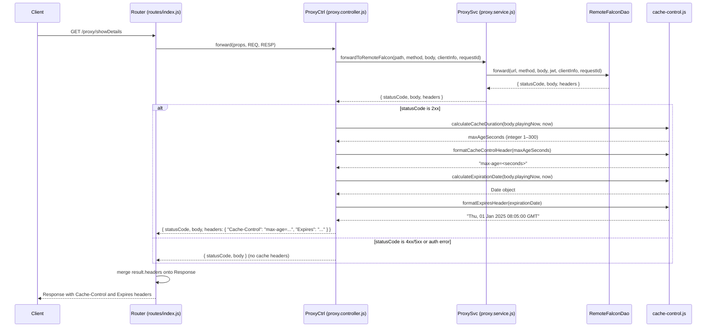

# Design Document: Dynamic Proxy Cache-Control

## Overview

This feature adds dynamic `Cache-Control` and `Expires` response headers to the proxy endpoint. The cache duration is determined by inspecting the `playingNow` field in the Remote Falcon API response body:

- When a sequence is actively playing (`playingNow` is a non-empty string), the response is cached for 5 seconds to allow near-real-time updates.
- When nothing is playing (`playingNow` is empty or null), the response is cached until the next 5-minute clock-aligned interval boundary (e.g., 08:00, 08:05, 08:10), up to a maximum of 300 seconds.

The `Cache-Control` header provides a relative `max-age` in seconds. The `Expires` header provides the same expiration as an absolute UTC timestamp in HTTP-date format (RFC 7234), making the interval alignment explicit for clients and CDNs. Both headers always agree on the same expiration moment.

The core calculations are implemented as pure functions in a utility module:
- `calculateCacheDuration(playingNow, now)` returns an integer `max-age` value (1–300).
- `calculateExpirationDate(playingNow, now)` returns a `Date` object representing the absolute expiration.
- `formatExpiresHeader(date)` formats a Date as an HTTP-date string.
- `parseExpiresHeader(headerValue)` parses an HTTP-date string back to a Date.

These functions are called by the proxy controller when building the response.

Error responses (4xx/5xx from Remote Falcon, or auth errors) do not receive `Cache-Control` or `Expires` headers.

## Architecture

The feature uses a utility module (`utils/cache-control.js`) and modifies the proxy controller. No changes are needed to the Router, ProxySvc, RemoteFalconDao, or ProxyView.



### Design Decisions

1. **Pure utility functions**: All cache calculations are pure functions with no side effects, making them trivially testable with property-based tests. The current time is injected as a parameter rather than read from `Date.now()` internally.

2. **Controller-level integration**: Both `Cache-Control` and `Expires` headers are added in `ProxyCtrl.forward()` rather than in the DAO or service layer. This keeps the DAO as a generic HTTP forwarder and places the caching policy decision at the controller level where response semantics are determined.

3. **No changes to Router**: The Router already merges `result.headers` onto the Response object, so no Router modifications are needed.

4. **Formatter/parser pairs**: Both `Cache-Control` and `Expires` have format/parse function pairs enabling round-trip testing of header values.

5. **Shared `now` timestamp**: The controller captures `new Date()` once and passes the same `now` to both `calculateCacheDuration` and `calculateExpirationDate`, ensuring both headers always agree on the same expiration moment.

6. **Separate calculation functions**: `calculateCacheDuration` returns relative seconds while `calculateExpirationDate` returns an absolute Date. Keeping them separate preserves the existing Cache-Control implementation and makes each function independently testable. Their consistency is verified by a cross-validation property test.

## Components and Interfaces

### Module: `utils/cache-control.js`

Existing functions (already implemented):

```javascript
/**
 * @module utils/cache-control
 */

/**
 * Calculate the Cache-Control max-age value based on playback state.
 *
 * @param {string|null} playingNow - The playingNow field from the Remote Falcon response
 * @param {Date} now - The current time
 * @returns {number} max-age in seconds (integer, 1–300 inclusive)
 */
function calculateCacheDuration(playingNow, now) { }

/**
 * Format a max-age integer into a Cache-Control header value.
 *
 * @param {number} maxAgeSeconds - The max-age value (positive integer)
 * @returns {string} e.g. "max-age=5"
 */
function formatCacheControlHeader(maxAgeSeconds) { }

/**
 * Parse a Cache-Control header value to extract the max-age integer.
 *
 * @param {string} headerValue - e.g. "max-age=5"
 * @returns {number} The max-age integer
 */
function parseCacheControlHeader(headerValue) { }
```

New functions to add:

```javascript
/**
 * Calculate the absolute expiration Date based on playback state.
 *
 * When a sequence is actively playing, returns now + 5 seconds.
 * When nothing is playing, returns the next 5-minute clock-aligned
 * interval boundary (e.g., if now is 08:01:30, returns 08:05:00).
 *
 * @param {string|null} playingNow - The playingNow field from the Remote Falcon response
 * @param {Date} now - The current time
 * @returns {Date} The absolute expiration timestamp
 */
function calculateExpirationDate(playingNow, now) { }

/**
 * Format a Date as an HTTP-date string per RFC 7234.
 *
 * @param {Date} date - The date to format
 * @returns {string} e.g. "Thu, 01 Jan 2025 08:05:00 GMT"
 */
function formatExpiresHeader(date) { }

/**
 * Parse an HTTP-date string to extract a Date object.
 *
 * @param {string} headerValue - e.g. "Thu, 01 Jan 2025 08:05:00 GMT"
 * @returns {Date} The parsed Date
 */
function parseExpiresHeader(headerValue) { }
```

### Modified Module: `controllers/proxy.controller.js`

The `forward` function is modified to:
1. Check if the response status code is 2xx.
2. Capture `now = new Date()` once.
3. Call `calculateCacheDuration(result.body.playingNow, now)` for the max-age.
4. Call `calculateExpirationDate(result.body.playingNow, now)` for the absolute expiration.
5. Format both headers and return them in `result.headers`.

```javascript
// In forward(), after receiving result from ProxySvc:
if (result.statusCode >= 200 && result.statusCode < 300) {
    const now = new Date();
    const maxAge = calculateCacheDuration(result.body?.playingNow, now);
    const expirationDate = calculateExpirationDate(result.body?.playingNow, now);
    return {
        statusCode: result.statusCode,
        body: ProxyView.forwardView(result),
        headers: {
            "Cache-Control": formatCacheControlHeader(maxAge),
            "Expires": formatExpiresHeader(expirationDate)
        }
    };
}

return {
    statusCode: result.statusCode,
    body: ProxyView.forwardView(result)
};
```

### Module: `utils/index.js`

No changes needed — `cache-control.js` is already exported.

## Data Models

### Input: Remote Falcon API Response Body

The response body from the Remote Falcon API includes a `playingNow` field at the top level:

```json
{
  "playingNow": "Jingle Bells",
  "sequences": [...],
  "preferences": {...}
}
```

| Field | Type | Description |
|-------|------|-------------|
| `playingNow` | `string \| null` | Non-empty string when a sequence is playing; empty string `""` or `null` when nothing is playing |

### Output: Response Headers

| Header | Format | Example |
|--------|--------|---------|
| `Cache-Control` | `max-age=<integer>` | `max-age=5`, `max-age=147` |
| `Expires` | HTTP-date (RFC 7234) | `Thu, 01 Jan 2025 08:05:00 GMT` |

### `calculateCacheDuration` Behavior

| `playingNow` | Current Time | Max-Age | Rationale |
|---|---|---|---|
| `"Jingle Bells"` | any | `5` | Active playback → short cache |
| `""` | 08:01:30 | `210` | 3.5 min to next boundary (08:05:00), floored to 210 whole seconds |
| `null` | 08:04:59 | `1` | 1 second to next boundary, clamped to minimum of 1 |
| `""` | 08:05:00 | `300` | Exactly on boundary → full 5-minute interval |
| `null` | 08:02:00 | `180` | 3 minutes to next boundary |

### `calculateExpirationDate` Behavior

| `playingNow` | Current Time | Expiration Date | Rationale |
|---|---|---|---|
| `"Jingle Bells"` | 08:01:30 | 08:01:35 | Active playback → now + 5 seconds |
| `""` | 08:01:30 | 08:05:00 | Next 5-minute boundary |
| `null` | 08:04:59 | 08:05:00 | Next 5-minute boundary |
| `""` | 08:05:00 | 08:10:00 | On boundary → next boundary (now + 300s) |
| `null` | 08:02:00 | 08:05:00 | Next 5-minute boundary |

### `formatExpiresHeader` / `parseExpiresHeader` Behavior

| Input Date (UTC) | Formatted Header |
|---|---|
| `2025-01-01T08:05:00.000Z` | `Wed, 01 Jan 2025 08:05:00 GMT` |
| `2025-12-25T00:00:00.000Z` | `Thu, 25 Dec 2025 00:00:00 GMT` |

The HTTP-date format follows RFC 7234: `<day-name>, <day> <month> <year> <hour>:<minute>:<second> GMT`.


## Correctness Properties

*A property is a characteristic or behavior that should hold true across all valid executions of a system — essentially, a formal statement about what the system should do. Properties serve as the bridge between human-readable specifications and machine-verifiable correctness guarantees.*

Properties 1–4 are already implemented and tested (Cache-Control). Properties 5–8 below cover the new Expires header functionality.

### Property 5: Non-playing expiration aligns to 5-minute boundary

*For any* Date `now` and any empty/null `playingNow` value, `calculateExpirationDate(playingNow, now)` SHALL return a Date whose UTC minutes are a multiple of 5 and whose UTC seconds are 0, and that Date SHALL be strictly after `now` and at most 300 seconds after `now`.

**Validates: Requirements 5.1, 5.2, 5.4, 6.4**

### Property 6: Expiration is always in the future

*For any* valid `playingNow` value (non-empty string, empty string, or null) and any Date `now`, `calculateExpirationDate(playingNow, now)` SHALL return a Date that is strictly after `now`.

**Validates: Requirements 5.4, 6.5**

### Property 7: Expires header round-trip

*For any* valid Date object, `parseExpiresHeader(formatExpiresHeader(date))` SHALL produce a Date whose time value equals the original Date's time value truncated to whole seconds (i.e., milliseconds discarded).

**Validates: Requirements 7.1, 7.2, 7.3**

### Property 8: Cache-Control and Expires consistency

*For any* valid `playingNow` value and any Date `now`, the expiration moment implied by `calculateExpirationDate(playingNow, now)` SHALL equal `now` plus `calculateCacheDuration(playingNow, now)` seconds. That is: `calculateExpirationDate(pn, now).getTime() === now.getTime() + calculateCacheDuration(pn, now) * 1000`.

**Validates: Requirements 8.1, 8.2**

## Error Handling

Error handling for the Expires header follows the same pattern as Cache-Control:

- **Non-2xx responses**: The controller does not add `Cache-Control` or `Expires` headers. The response is returned as-is from ProxyView.
- **Auth errors** (credential retrieval failure): The controller returns a 500 AUTH_ERROR response without any cache headers.
- **Invalid Date guard**: `calculateExpirationDate` guards against invalid Date inputs (NaN) by returning a fallback Date 300 seconds in the future, consistent with `calculateCacheDuration`'s fallback behavior.
- **Missing playingNow**: If `result.body?.playingNow` is undefined, it is treated as null (non-playing state), producing interval-aligned expiration.

## Testing Strategy

### Dual Testing Approach

- **Unit tests**: Verify specific examples, edge cases, and error conditions with concrete inputs.
- **Property tests**: Verify universal properties across all inputs using fast-check with minimum 100 iterations per property.

Both are complementary: unit tests catch concrete bugs at known boundaries, property tests verify general correctness across the input space.

### Existing Tests (Cache-Control — already complete)

- Unit tests in `cache-control.test.js`: specific examples for `calculateCacheDuration`, `formatCacheControlHeader`, `parseCacheControlHeader`
- Property tests in `cache-control.property.test.js`: Properties 1–4 (range bounds, active playback constant, monotonic decrease, round-trip)
- Controller tests in `cache-control.controller.test.js`: 2xx includes header, 4xx/5xx omits header, auth error omits header

### New Tests (Expires Header)

Unit tests to add to `cache-control.test.js`:
- `calculateExpirationDate` with non-empty playingNow → returns now + 5s
- `calculateExpirationDate` with empty/null at various times → returns next 5-minute boundary
- `calculateExpirationDate` on exact boundary → returns now + 300s
- `formatExpiresHeader` produces correct HTTP-date strings
- `parseExpiresHeader` extracts correct Date from HTTP-date strings

Property tests to add to `cache-control.property.test.js`:
- **Property 5**: Non-playing expiration aligns to 5-minute boundary (tag: `Feature: 0-0-1-dynamic-proxy-cache-control, Property 5`)
- **Property 6**: Expiration is always in the future (tag: `Feature: 0-0-1-dynamic-proxy-cache-control, Property 6`)
- **Property 7**: Expires header round-trip (tag: `Feature: 0-0-1-dynamic-proxy-cache-control, Property 7`)
- **Property 8**: Cache-Control and Expires consistency (tag: `Feature: 0-0-1-dynamic-proxy-cache-control, Property 8`)

All property tests use `fast-check` with `{ numRuns: 100 }`.

Controller tests to add to `cache-control.controller.test.js`:
- 2xx responses include both `Cache-Control` and `Expires` headers
- 4xx/5xx responses include neither header
- Auth error responses include neither header

### Property-Based Testing Library

- **Library**: fast-check (already installed)
- **Framework**: Jest (project standard)
- **Minimum iterations**: 100 per property
- **Tag format**: `Feature: 0-0-1-dynamic-proxy-cache-control, Property {number}: {title}`
