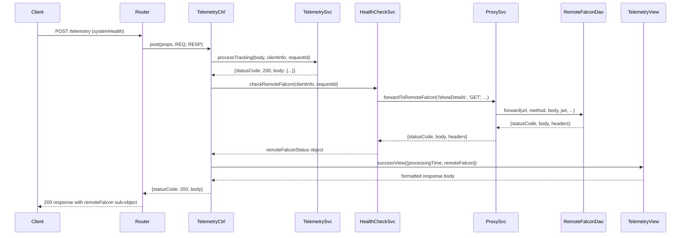

# Design Document: Health Status

## Overview

This feature adds Remote Falcon connectivity checking to the `POST /telemetry` endpoint for `systemHealth` events. When a `systemHealth` telemetry event is processed, the system calls the Remote Falcon `GET /showDetails` endpoint via the existing `ProxySvc.forwardToRemoteFalcon()` and includes a `remoteFalcon` status sub-object in the response. The sub-object reports connectivity (`isConnected`), HTTP status code, and lightweight metadata (viewer control preferences and current playback info). Non-`systemHealth` events are unaffected.

The health check is informational — failures are reported gracefully in the response rather than causing the telemetry endpoint to error. A 5-second timeout prevents slow Remote Falcon responses from blocking the telemetry endpoint.

## Architecture

The feature introduces a single new service (`HealthCheckSvc`) that sits between the existing controller and proxy layers. The data flow for `systemHealth` events becomes:



For non-`systemHealth` events, the flow is unchanged — `HealthCheckSvc` is never called.

### Design Decisions

1. **Health check in the controller, not the service**: `TelemetrySvc.processTracking()` handles validation and logging. The health check is a separate concern (external API call) that the controller orchestrates after successful telemetry processing. This keeps `TelemetrySvc` focused on validation/logging and avoids coupling it to `ProxySvc`.

2. **Reuse `ProxySvc.forwardToRemoteFalcon()`**: Rather than making a direct `fetch` call, the health check delegates to the existing proxy service which handles JWT authentication and structured logging. The 5-second timeout is applied by wrapping the `ProxySvc` call with `AbortController` at the `HealthCheckSvc` level.

3. **Never-throw design**: `HealthCheckSvc.checkRemoteFalcon()` always returns a result object — it catches all errors (network, timeout, auth) and maps them to `{isConnected: false, ...}`. This ensures the telemetry endpoint always returns 200 for valid `systemHealth` events.

## Components and Interfaces

### New: `HealthCheckSvc` (`services/health-check.service.js`)

```javascript
/**
 * @module services/health-check.service
 */

/**
 * Check Remote Falcon connectivity via GET /showDetails.
 *
 * @async
 * @param {{ipAddress: string, userAgent: string, host: string}} clientInfo
 * @param {string} requestId
 * @returns {Promise<RemoteFalconStatus>} Always resolves, never throws
 */
async function checkRemoteFalcon(clientInfo, requestId) { }
```

Returns one of two shapes:

**Success** (`isConnected: true`):
```javascript
{
  isConnected: true,
  statusCode: 200,
  viewerControlEnabled: true,
  viewerControlMode: "jukebox",
  playingNow: "Let It Go",
  playingNext: "Into the Unknown"
}
```

**Failure** (`isConnected: false`):
```javascript
{
  isConnected: false,
  statusCode: 0,       // 0 for network/timeout errors, or actual HTTP status
  error: "descriptive message"
}
```

### Modified: `TelemetryCtrl.post()` (`controllers/telemetry.controller.js`)

After `TelemetrySvc.processTracking()` returns 200, the controller checks if `body.eventType === 'systemHealth'`. If so, it calls `HealthCheckSvc.checkRemoteFalcon()` and passes the result to `TelemetryView.successView()`.

```javascript
// Existing success path changes from:
if (result.statusCode === 200) {
  return {
    statusCode: result.statusCode,
    body: TelemetryView.successView({ processingTime: result.body.processingTime })
  };
}

// To:
if (result.statusCode === 200) {
  const viewData = { processingTime: result.body.processingTime };

  if (body.eventType === 'systemHealth') {
    viewData.remoteFalcon = await HealthCheckSvc.checkRemoteFalcon(clientInfo, requestId);
  }

  return {
    statusCode: result.statusCode,
    body: TelemetryView.successView(viewData)
  };
}
```

### Modified: `TelemetryView.successView()` (`views/telemetry.view.js`)

Accepts an optional `remoteFalcon` property in the data parameter. When present, includes it in the response body.

```javascript
const successView = (data) => {
  const response = {
    message: 'Tracking data received successfully',
    timestamp: new Date().toISOString(),
    processingTime: data.processingTime
  };

  if (data.remoteFalcon) {
    response.remoteFalcon = data.remoteFalcon;
  }

  return response;
};
```

### Modified: `services/index.js`

Exports the new `HealthCheckSvc`:

```javascript
const HealthCheckSvc = require("./health-check.service");
// ... existing exports
module.exports = { ProxySvc, JwtSvc, TelemetrySvc, HealthCheckSvc };
```

## Data Models

### `RemoteFalconStatus` (success shape)

| Field                  | Type             | Description                                      |
|------------------------|------------------|--------------------------------------------------|
| `isConnected`          | `boolean`        | `true` when Remote Falcon returned 2xx           |
| `statusCode`           | `number`         | HTTP status code from Remote Falcon              |
| `viewerControlEnabled` | `boolean`        | From `response.preferences.viewerControlEnabled` |
| `viewerControlMode`    | `string`         | From `response.preferences.viewerControlMode`    |
| `playingNow`           | `string \| null` | From `response.playingNow`                       |
| `playingNext`          | `string \| null` | From `response.playingNext`                      |

### `RemoteFalconStatus` (failure shape)

| Field         | Type      | Description                                                    |
|---------------|-----------|----------------------------------------------------------------|
| `isConnected` | `boolean` | Always `false`                                                 |
| `statusCode`  | `number`  | HTTP status from Remote Falcon, or `0` for network/timeout     |
| `error`       | `string`  | Descriptive error message                                      |

Failure responses never include `viewerControlEnabled`, `viewerControlMode`, `playingNow`, or `playingNext`.

### `showDetails` Response (from Remote Falcon API)

The `GET /showDetails` endpoint returns a JSON object. The health check extracts only:

```javascript
{
  preferences: {
    viewerControlEnabled: true,    // extracted
    viewerControlMode: "jukebox",  // extracted
    // ... other fields ignored
  },
  playingNow: "Let It Go",        // extracted
  playingNext: "Into the Unknown", // extracted
  sequences: [...],                // ignored
  sequenceGroups: [...],           // ignored
  requests: [...],                 // ignored
  votes: [...]                     // ignored
}
```

### Timeout Configuration

The health check uses a 5000ms timeout constant:

```javascript
const HEALTH_CHECK_TIMEOUT_MS = 5000;
```

This is applied via `AbortController` wrapping the `ProxySvc.forwardToRemoteFalcon()` call, or via `Promise.race` with a timeout promise.

