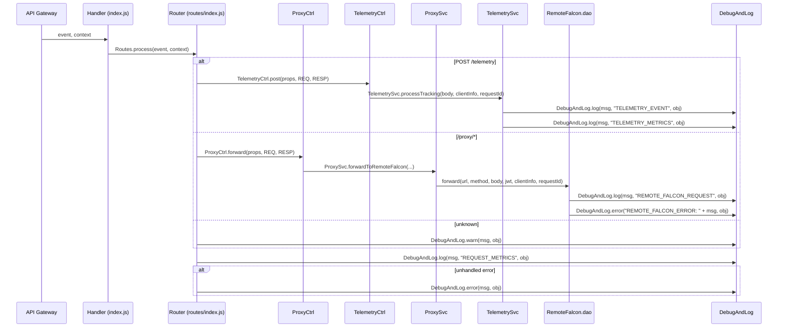

# Design Document: Logging Updates

## Overview

This feature migrates all structured application logging from direct `console.log`, `console.error`, and `console.warn` calls to the `DebugAndLog` utility from `@63klabs/cache-data`. The migration standardizes log output across three modules — `RemoteFalcon.dao.js`, `telemetry.service.js`, and `routes/index.js` — so that every structured log entry uses the `[TAG] message | obj` format that DebugAndLog produces.

The migration is internal-only (no external API changes) and preserves all existing structured data fields so that CloudWatch Log Insights queries continue to work. The feature also adds per-log-type query examples to the admin-ops documentation.

### Design Rationale

- DebugAndLog is already initialized in `config/index.js` and used throughout the handler (`index.js`) and router for debug-level logging. Extending its use to all structured logs unifies the logging approach.
- DebugAndLog provides log-level awareness (production vs. debug), consistent formatting, and a single point of control for log output — advantages over raw `console.*` calls.
- Since this is internal logging not accessed outside the application, backwards compatibility is not a concern.

### Scope

| Module | Current Calls to Migrate | Target DebugAndLog Method |
|--------|--------------------------|---------------------------|
| `RemoteFalcon.dao.js` | `console.log` (REMOTE_FALCON_REQUEST, REMOTE_FALCON_ERROR), `console.error` | `DebugAndLog.log()`, `DebugAndLog.error()` |
| `telemetry.service.js` | `console.log` (TELEMETRY_EVENT, TELEMETRY_METRICS) | `DebugAndLog.log()` |
| `routes/index.js` | `console.log` (REQUEST_METRICS), `console.error` (LAMBDA_ERROR), `console.warn` (unknown endpoint) | `DebugAndLog.log()`, `DebugAndLog.error()`, `DebugAndLog.warn()` |
| `docs/admin-ops/README.md` | N/A | Add per-log-type Log Insights query examples |

## Architecture

The migration does not change the application architecture. The existing request flow remains:



### Key Design Decision

DebugAndLog is a static utility — no instantiation required. It is already imported in `routes/index.js`. The two modules that need new imports are `RemoteFalcon.dao.js` and `telemetry.service.js`.

## Components and Interfaces

### DebugAndLog API (from @63klabs/cache-data)

The DebugAndLog utility provides three methods relevant to this migration:

| Method | Signature | Output Format | Use Case |
|--------|-----------|---------------|----------|
| `log` | `DebugAndLog.log(message, tag, obj)` | `[TAG] message \| obj` | Tagged informational logs |
| `error` | `DebugAndLog.error(message, obj)` | `[ERROR] message \| obj` | Error-level logs |
| `warn` | `DebugAndLog.warn(message, obj)` | `[WARN] message \| obj` | Warning-level logs |

Only `log()` accepts a `tag` parameter (second positional argument). `error()` and `warn()` do not have a tag parameter.

### Module Changes

#### 1. RemoteFalcon.dao.js

**Import addition:**
```javascript
const { tools: { DebugAndLog } } = require("@63klabs/cache-data");
```

**Logging changes:**

| Current Code | New Code |
|-------------|----------|
| `console.log(\`REMOTE_FALCON_REQUEST: ${JSON.stringify(successLog)}\`)` | `DebugAndLog.log("Remote Falcon request succeeded", "REMOTE_FALCON_REQUEST", successLog)` |
| `console.log(\`REMOTE_FALCON_ERROR: ${JSON.stringify(errorLog)}\`)` | `DebugAndLog.error(\`REMOTE_FALCON_ERROR: ${JSON.stringify(errorLog)}\`, errorLog)` |
| `console.error("Failed to forward request to Remote Falcon:", error)` | *(removed — covered by the DebugAndLog.error call above)* |

#### 2. telemetry.service.js

**Import addition:**
```javascript
const { tools: { DebugAndLog } } = require("@63klabs/cache-data");
```

**Logging changes:**

| Current Code | New Code |
|-------------|----------|
| `console.log('TELEMETRY_EVENT:', JSON.stringify(logEntry))` | `DebugAndLog.log("Telemetry event received", "TELEMETRY_EVENT", logEntry)` |
| `console.log('TELEMETRY_METRICS:', JSON.stringify(metricsObj))` | `DebugAndLog.log("Telemetry metrics", "TELEMETRY_METRICS", metricsObj)` |

#### 3. routes/index.js

**Import:** Already imports DebugAndLog — no change needed.

**Logging changes:**

| Current Code | New Code |
|-------------|----------|
| `console.warn("Unknown endpoint requested:", JSON.stringify({...}))` | `DebugAndLog.warn("Unknown endpoint requested", { path, method, requestId })` |
| `console.log("REQUEST_METRICS:", JSON.stringify({...}))` (×3 locations) | `DebugAndLog.log("Request metrics", "REQUEST_METRICS", {...})` |
| `console.error("LAMBDA_ERROR:", JSON.stringify({...}))` | `DebugAndLog.error("LAMBDA_ERROR: Unhandled error during request processing", {...})` |

### Documentation Changes

#### docs/admin-ops/README.md

Add per-log-type CloudWatch Log Insights query examples and a note about the `[TAG] message | obj` format produced by DebugAndLog.

## Data Models

No data model changes. The structured log entry objects remain identical — only the transport mechanism changes from `console.*` to `DebugAndLog.*`.

### Preserved Log Entry Structures

**REMOTE_FALCON_REQUEST** (built by RemoteFalconLogBuilder.buildSuccessLog):
```json
{
  "timestamp": "ISO-8601",
  "requestId": "string",
  "logType": "REMOTE_FALCON_REQUEST",
  "status": "SUCCESS",
  "request": { "method": "string", "path": "string", "ip": "string", "userAgent": "string", "host": "string" },
  "response": { "status": 200, "processingTime": 123, "dataSummary": {} }
}
```

**REMOTE_FALCON_ERROR** (built by RemoteFalconLogBuilder.buildErrorLog):
```json
{
  "timestamp": "ISO-8601",
  "requestId": "string",
  "logType": "REMOTE_FALCON_ERROR",
  "status": "ERROR",
  "request": { "method": "string", "path": "string", "ip": "string", "userAgent": "string", "host": "string" },
  "error": { "type": "string", "message": "string", "httpStatus": 500, "processingTime": 123 }
}
```

**TELEMETRY_EVENT:**
```json
{
  "timestamp": "ISO-8601",
  "eventType": "string",
  "ipAddress": "string",
  "userAgent": "string",
  "host": "string",
  "url": "string",
  "eventData": {},
  "processingTime": 123,
  "requestId": "string"
}
```

**TELEMETRY_METRICS:**
```json
{
  "timestamp": "ISO-8601",
  "eventType": "string",
  "processingTime": 123,
  "success": true,
  "requestId": "string"
}
```

**REQUEST_METRICS:**
```json
{
  "requestId": "string",
  "timestamp": "ISO-8601",
  "method": "string",
  "path": "string",
  "statusCode": 200,
  "processingTime": 123,
  "totalTime": 456,
  "success": true
}
```

**LAMBDA_ERROR:**
```json
{
  "requestId": "string",
  "timestamp": "ISO-8601",
  "error": { "message": "string", "name": "string", "stack": "string" },
  "request": { "method": "string", "path": "string", "origin": "string", "userAgent": "string" },
  "totalTime": 456
}
```


## Correctness Properties

*A property is a characteristic or behavior that should hold true across all valid executions of a system — essentially, a formal statement about what the system should do. Properties serve as the bridge between human-readable specifications and machine-verifiable correctness guarantees.*

### Property 1: Successful Remote Falcon requests use DebugAndLog with preserved structure

*For any* successful Remote Falcon API response (HTTP 2xx with no application-level error), the RemoteFalcon DAO shall call `DebugAndLog.log` with the tag `"REMOTE_FALCON_REQUEST"` and a structured object containing timestamp, requestId, logType, status, request details, and response details — and shall not call `console.log`.

**Validates: Requirements 1.1, 1.2, 9.1**

### Property 2: Failed Remote Falcon requests use DebugAndLog.error with preserved structure

*For any* Remote Falcon API error response (HTTP 4xx/5xx or application-level error in a 2xx response), the RemoteFalcon DAO shall call `DebugAndLog.error` with a message containing `"REMOTE_FALCON_ERROR:"` and a structured object containing timestamp, requestId, logType, status, request details, and error details — and shall not call `console.log`.

**Validates: Requirements 2.1, 2.2, 2.5, 9.2**

### Property 3: Valid telemetry events use DebugAndLog with preserved structure for both event and metrics

*For any* valid telemetry tracking event, the Telemetry Service shall call `DebugAndLog.log` twice — once with tag `"TELEMETRY_EVENT"` and the full event log entry (timestamp, eventType, ipAddress, userAgent, host, url, eventData, processingTime, requestId), and once with tag `"TELEMETRY_METRICS"` and the metrics object (timestamp, eventType, processingTime, success, requestId) — and shall not call `console.log`.

**Validates: Requirements 3.1, 3.2, 4.1, 4.2, 9.3, 9.4**

### Property 4: All request outcomes log REQUEST_METRICS via DebugAndLog with preserved structure

*For any* request processed by the Router (successful, 404, or error), the Router shall call `DebugAndLog.log` with the tag `"REQUEST_METRICS"` and a structured object containing requestId, timestamp, method, path, statusCode, processingTime, totalTime, and success — and shall not call `console.log` for REQUEST_METRICS entries.

**Validates: Requirements 5.1, 5.2, 5.3, 5.4, 9.5**

### Property 5: Unhandled errors use DebugAndLog.error with preserved structure

*For any* unhandled error during request processing, the Router shall call `DebugAndLog.error` with a descriptive message and a structured object containing requestId, timestamp, error details (message, name, stack), request context (method, path, origin, userAgent), and totalTime — and shall not call `console.error`.

**Validates: Requirements 6.1, 6.2, 9.6**

### Property 6: Unknown endpoints use DebugAndLog.warn

*For any* request to an unknown endpoint, the Router shall call `DebugAndLog.warn` with a descriptive message and an object containing path, method, and requestId — and shall not call `console.warn`.

**Validates: Requirements 7.1, 7.2**

## Error Handling

No changes to error handling behavior. The migration only changes the logging transport — all error detection, classification, and response formatting remain identical.

- HTTP errors (4xx/5xx) from Remote Falcon API → logged via `DebugAndLog.error`, response returned to client
- Application-level errors in 200 responses → detected by `RemoteFalconLogBuilder.detectApplicationError`, logged via `DebugAndLog.error`
- Network errors → logged via `DebugAndLog.error`, rethrown as `"Failed to communicate with Remote Falcon API"`
- Unhandled errors in Router → logged via `DebugAndLog.error`, 500 response returned to client
- Unknown endpoints → logged via `DebugAndLog.warn`, 404 response returned to client

## Testing Strategy

### Dual Testing Approach

This feature is well-suited for property-based testing because:
- The logging behavior should hold universally across all valid inputs (any HTTP status, any response body, any telemetry event, any request path)
- Input variation reveals edge cases (special characters in paths, large response bodies, various error types)
- The code under test is deterministic given mocked dependencies

### Property-Based Tests

**Library:** fast-check (already in devDependencies)
**Framework:** Jest (per project conventions)
**File:** `application-infrastructure/src/tests/logging.property.test.js` (update existing file)
**Minimum iterations:** 100 per property

Each property test will:
1. Mock `DebugAndLog.log`, `DebugAndLog.error`, `DebugAndLog.warn` to capture calls
2. Spy on `console.log`, `console.error`, `console.warn` to verify they are NOT called
3. Generate random valid inputs using fast-check arbitraries
4. Execute the function under test
5. Assert DebugAndLog was called with the correct method, tag, and structured object
6. Assert console.* was not called for structured log entries

**Tag format:** `Feature: logging-updates, Property {N}: {title}`

### Unit Tests (Example-Based)

- Network error logging in RemoteFalcon DAO (Requirements 2.3, 2.4) — specific mock of fetch throwing
- Documentation content verification (Requirement 10) — verify query examples exist in admin-ops README
- Import verification (Requirement 8) — smoke tests that modules load with DebugAndLog available

### Static Analysis

- Verify zero `console.log`/`console.error`/`console.warn` calls for structured log entries in migrated modules (Requirement 11) — can be a grep-based test or code review check
