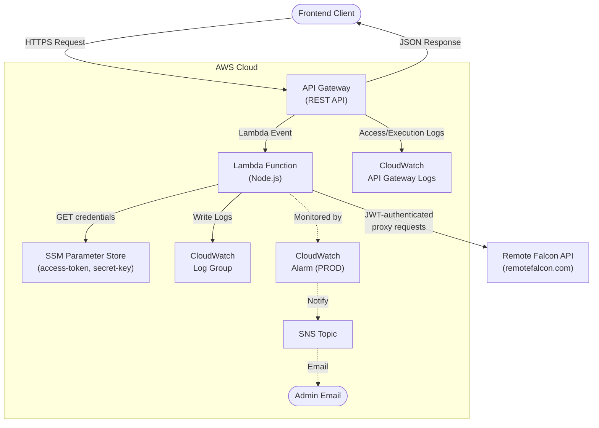
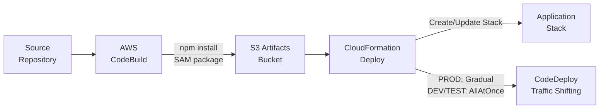

# Architecture

## Directory Structure

```
├── application-infrastructure/    # AWS SAM application stack
│   ├── build-scripts/             # Python scripts used during CodeBuild
│   │   ├── generate-put-ssm.py
│   │   ├── update_template_configuration.py
│   │   └── update_template_timestamp.py
│   ├── src/                       # Lambda function source code (Node.js)
│   │   ├── config/                # Configuration and initialization
│   │   │   ├── index.js           # Config class, CachedSsmParameter setup
│   │   │   ├── connections.js     # Remote Falcon API endpoint connection
│   │   │   ├── responses.js       # Response code definitions
│   │   │   ├── settings.js        # App settings (API URL, allowed origins)
│   │   │   └── validations.js     # Request validation rules
│   │   ├── controllers/           # Request handlers (MVC Controller layer)
│   │   │   ├── index.js           # Barrel export
│   │   │   ├── proxy.controller.js    # Proxy endpoint handler
│   │   │   └── telemetry.controller.js # Telemetry endpoint handler
│   │   ├── models/                # Data access objects (MVC Model layer)
│   │   │   ├── index.js           # Barrel export
│   │   │   ├── RemoteFalcon.dao.js    # Remote Falcon API communication
│   │   │   └── static-data/      # Static reference data
│   │   ├── routes/                # Request routing
│   │   │   └── index.js          # Router — dispatches to controllers
│   │   ├── services/              # Business logic (MVC Service layer)
│   │   │   ├── index.js           # Barrel export
│   │   │   ├── jwt.service.js     # JWT generation and credential caching
│   │   │   ├── proxy.service.js   # Proxy forwarding orchestration
│   │   │   └── telemetry.service.js # Telemetry validation and processing
│   │   ├── utils/                 # Shared utilities
│   │   │   ├── index.js           # Barrel export
│   │   │   ├── cors.js            # CORS origin matching and security headers
│   │   │   ├── hash.js            # Hashing utilities
│   │   │   ├── helper-functions.js # General helpers
│   │   │   └── RemoteFalconLogBuilder.js # Structured log entry builder
│   │   ├── views/                 # Response formatting (MVC View layer)
│   │   │   ├── index.js           # Barrel export
│   │   │   ├── proxy.view.js      # Proxy response formatting
│   │   │   └── telemetry.view.js  # Telemetry response formatting
│   │   ├── tests/                 # Unit and property-based tests
│   │   ├── index.js               # Lambda handler entry point
│   │   └── package.json           # Node.js dependencies
│   ├── buildspec.yml              # AWS CodeBuild build specification
│   ├── template.yml               # AWS SAM/CloudFormation template
│   ├── template-dashboard.yml     # CloudWatch Dashboard (module in template.yml)
│   ├── template-openapi-spec.yml  # OpenAPI Spec (module in template.yml for API Gateway)
│   └── template-configuration.json # Stack parameter overrides
├── docs/                          # Documentation
│   ├── admin-ops/                 # For Admin, Operations
│   ├── developer/                 # For Developer maintaining application
│   └── end-user/                  # For consumer of this application's API
├── old-backend/                   # Reference implementation (immutable)
├── AGENTS.md                      # AI and developer guidelines
├── CHANGELOG.md
├── DEPLOYMENT.md
├── ARCHITECTURE.md
└── README.md
```

## Application Stack



### Request Flow

1. API Gateway receives HTTPS request, invokes Lambda
2. Lambda handler runs cold-start init (`Config.promise()`, `Config.prime()`)
3. Router creates `ClientRequest` and `Response`, applies CORS and security headers
4. Router dispatches to the appropriate Controller based on method + path
5. Controller calls Service(s) for business logic
6. Service calls Model/DAO for external data (Remote Falcon API, SSM)
7. Controller passes result to View for response formatting
8. Router returns the formatted `Response` object
9. Handler calls `response.finalize()` to return to API Gateway

### Credential Flow

```
SSM Parameter Store
  └─ ${PARAM_STORE_HIERARCHY}RemoteFalcon/access-token
  └─ ${PARAM_STORE_HIERARCHY}RemoteFalcon/secret-key
        │
        ▼
  CachedSsmParameter (12-hour refresh)
        │
        ▼
  jwt.service.js → generateJWT(accessToken, secretKey)
        │              HS256-signed, 1-hour expiration
        ▼
  JWT cache (55-minute TTL)
        │
        ▼
  RemoteFalcon.dao.js → Authorization: Bearer <jwt>
        │
        ▼
  Remote Falcon API (remotefalcon.com/remote-falcon-external-api)
```

SSM parameter paths follow the Atlantis hierarchy:

- `${PARAM_STORE_HIERARCHY}RemoteFalcon/access-token`
- `${PARAM_STORE_HIERARCHY}RemoteFalcon/secret-key`

Where `PARAM_STORE_HIERARCHY` resolves to something like `/<OrgHierarchy>/<DeployEnvironment>/<Prefix>-<ProjectId>-<StageId>/`.

## Deployment Pipeline



## Key Design Decisions

- **MVC architecture** decomposes the monolithic old-backend into Router → Controller → Service → Model/DAO → View layers following Atlantis conventions.
- **CORS origin matching** is handled at the application level (`src/utils/cors.js`) to maintain behavioral parity with the old-backend, including wildcard pattern support and security headers.
- **JWT caching** uses a 55-minute in-memory TTL (tokens expire at 1 hour) to minimize token generation overhead while ensuring tokens are refreshed before expiration.
- **Credential caching** uses `CachedSsmParameter` with a 12-hour `refreshAfter` to reduce SSM API calls, since credentials rarely change.
- **`endpoint.send()`** from `@63klabs/cache-data` replaces raw `fetch` in the DAO for built-in X-Ray tracing.
- **Structured log entries** (`REMOTE_FALCON_REQUEST`, `TELEMETRY_EVENT`, `REQUEST_METRICS`, etc.) are emitted via `console.log` to preserve format parity with old-backend for CloudWatch log filters.
- **Gradual deployments** are enabled only in PROD (via CodeDeploy traffic shifting); DEV/TEST deploy all-at-once.
- **CloudWatch Alarms** and SNS notifications are created only in PROD to reduce cost.
- **API Gateway logging** (access + execution) is opt-in and requires an account-level service role.
- **Permissions Boundary** support is optional, controlled via a stack parameter.
