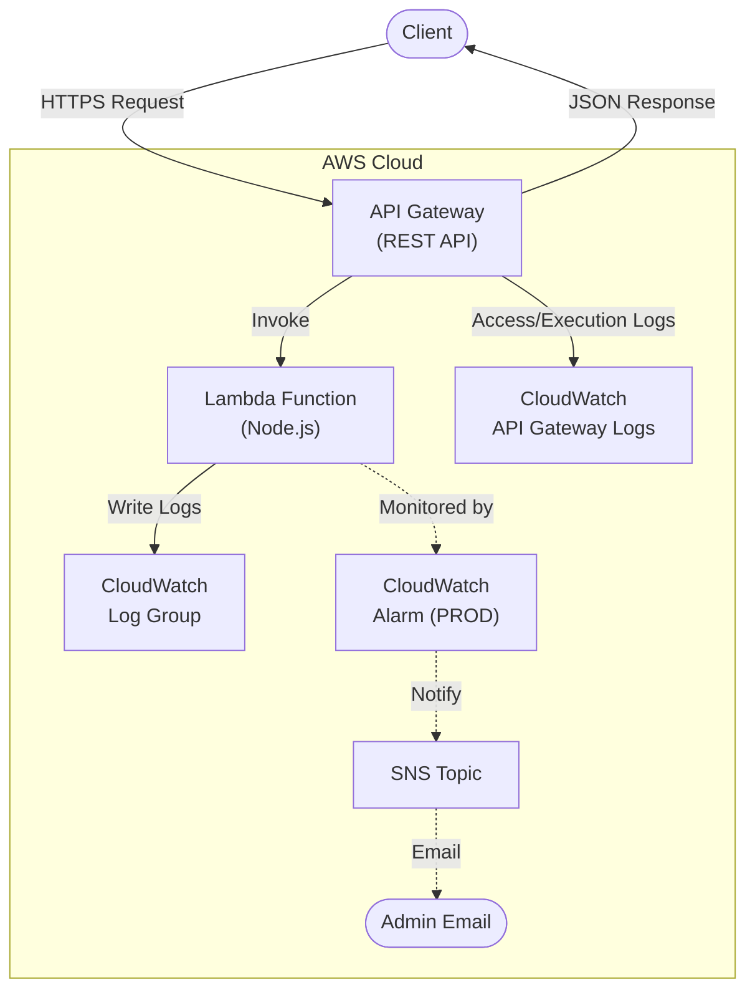
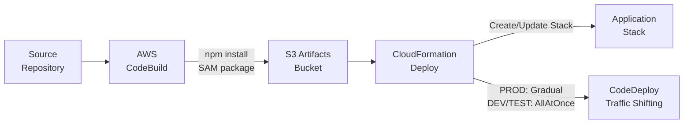

# Architecture

## Directory Structure

```
├── application-infrastructure/    # AWS SAM application stack
│   ├── build-scripts/             # Python scripts used during CodeBuild
│   │   ├── generate-put-ssm.py
│   │   ├── update_template_configuration.py
│   │   └── update_template_timestamp.py
│   ├── src/                       # Lambda function source code (Node.js)
│   │   ├── index.js               # Lambda handler entry point
│   │   └── package.json           # Node.js dependencies
│   ├── buildspec.yml              # AWS CodeBuild build specification
│   ├── template.yml               # AWS SAM/CloudFormation template
│   ├── template-dashboard.yml      # AWS CloudWatch Dashboard (included as module in template.yml)
│   ├── template-openapi-spec.yml   # Open API Spec (included as module in template.yml for API Gateway)
│   └── template-configuration.json # Stack parameter overrides
├── docs/                          # Documentation
│   ├── admin-ops/                 # For Admin, Operations
│   ├── developer/                 # For Developer maintaining application
│   └── end-user/                  # For consumer of this application's output (API, Site, Exported reports)
├── scripts/                       # Utility scripts ran by developer (Not part of deployment)
│   └── generate-sidecar-metadata.py
├── AGENTS.md                      # AI and developer guidelines
├── CHANGELOG.md
├── DEPLOYMENT.md
├── ARCHITECTURE.md
└── README.md
```

## Application Stack



## Deployment Pipeline



## Key Design Decisions

- **Gradual deployments** are enabled only in PROD (via CodeDeploy traffic shifting); DEV/TEST deploy all-at-once.
- **CloudWatch Alarms** and SNS notifications are created only in PROD to reduce cost.
- **API Gateway logging** (access + execution) is opt-in and requires an account-level service role to be configured first.
- **Permissions Boundary** support is optional, controlled via a stack parameter.
